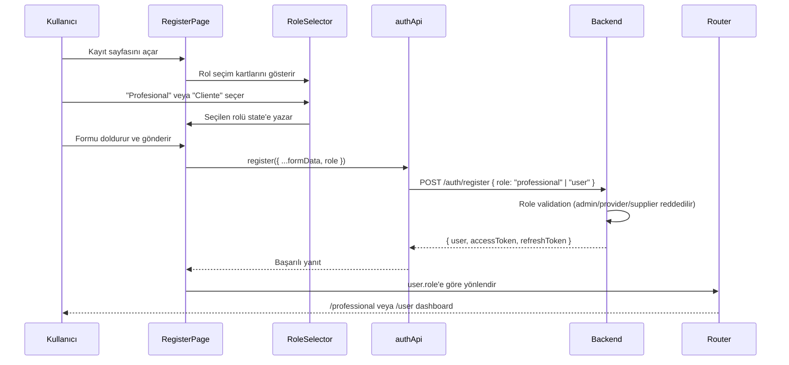

# Design Document: Dual Profile Registration

## Overview

Bu tasarım, e-MANO platformundaki kayıt akışına çift profil seçimi ekler. Kullanıcılar kayıt sırasında "Profesional" veya "Cliente" rolünü seçer, bu rol backend'e iletilir ve kayıt sonrası kullanıcı rolüne uygun dashboard'a yönlendirilir. Ayrıca her rol için özelleştirilmiş profil sayfaları oluşturulur.

Mevcut altyapı büyük ölçüde bu özelliği desteklemektedir:
- Backend `RegisterDto` zaten opsiyonel `role` alanını kabul ediyor
- Frontend `UserRole` enum'u `PROFESSIONAL` ve `USER` değerlerini içeriyor
- Routing yapısı `/professional/*` ve `/user/*` yollarını zaten tanımlıyor
- i18n sistemi İspanyolca (birincil) ve İngilizce (ikincil) desteği sunuyor

Temel değişiklikler frontend tarafında yoğunlaşacak: `RegisterPage`'e rol seçim kartları eklenmesi, `RegisterRequest` tipinin güncellenmesi, kayıt sonrası rol bazlı yönlendirme ve müşteri profil sayfası oluşturulması.

## Architecture

### Değişiklik Kapsamı

```mermaid
flowchart TD
    subgraph Frontend["Frontend (React + TypeScript)"]
        RP[RegisterPage.tsx] --> RS[RoleSelector Bileşeni]
        RP --> API[authApi.ts - RegisterRequest]
        API --> BE[Backend /auth/register]
        
        RP -->|Kayıt Sonrası| DR[Dashboard Router]
        DR -->|professional| PD[/professional]
        DR -->|user| UD[/user]
        
        PP[ProfessionalProfilePage] -->|Mevcut - Güncelleme| PAPI[professionalDashboardApi]
        CP[ClientProfilePage] -->|Yeni| UAPI[userApi]
    end
    
    subgraph Backend["Backend (NestJS)"]
        BE --> VAL[Role Validation Guard]
        VAL --> DB[(PostgreSQL)]
    end
    
    subgraph i18n["i18n"]
        ES[es.json]
        EN[en.json]
    end
```

### Akış Diyagramı



## Components and Interfaces

### 1. RoleSelector Bileşeni (Yeni)

`packages/web-frontend/src/components/auth/RoleSelector.tsx`

Kayıt formunda rol seçimi için kullanılan kart tabanlı bileşen.

```typescript
interface RoleSelectorProps {
  selectedRole: 'professional' | 'user' | null;
  onRoleSelect: (role: 'professional' | 'user') => void;
  error?: string;
}
```

Tasarım kararları:
- Radyo grubu semantiği (`role="radiogroup"`, `role="radio"`, `aria-checked`) ile erişilebilirlik sağlanır
- Seçili kart mavi border ve açık mavi arka plan ile vurgulanır (mevcut Tailwind sınıfları)
- Her kart bir ikon, başlık ve açıklama içerir
- Klavye navigasyonu: Tab ile kartlar arası geçiş, Enter/Space ile seçim

### 2. RegisterPage Güncellemesi

`packages/web-frontend/src/pages/auth/RegisterPage.tsx`

Mevcut forma eklenen değişiklikler:
- `formData` state'ine `role: 'professional' | 'user' | null` eklenir
- Form alanlarının üstüne `RoleSelector` bileşeni yerleştirilir
- `validateForm` fonksiyonuna rol seçimi kontrolü eklenir
- `handleSubmit` fonksiyonunda `role` değeri API çağrısına dahil edilir
- Kayıt sonrası `user.role`'e göre yönlendirme yapılır

### 3. RegisterRequest Interface Güncellemesi

`packages/web-frontend/src/store/api/authApi.ts`

```typescript
interface RegisterRequest {
  email: string;
  password: string;
  firstName: string;
  lastName: string;
  role?: 'professional' | 'user';
}
```

### 4. Backend Role Validation

`packages/backend/src/modules/auth/auth.service.ts`

Mevcut `register` metoduna eklenen doğrulama:
- `role` alanı sadece `professional` veya `user` değerlerini kabul eder
- `admin`, `provider`, `supplier` değerleri `BadRequestException` ile reddedilir
- `role` belirtilmezse varsayılan olarak `user` atanır (mevcut davranış korunur)

```typescript
// auth.service.ts register metoduna eklenecek
const allowedPublicRoles = [UserRole.PROFESSIONAL, UserRole.USER];
if (role && !allowedPublicRoles.includes(role)) {
  throw new BadRequestException('Invalid role for public registration');
}
```

### 5. ClientProfilePage (Yeni)

`packages/web-frontend/src/pages/user/ClientProfilePage.tsx`

Müşteri kullanıcılar için profil sayfası:
- Adres bilgileri (sokak, şehir, eyalet, posta kodu)
- Tercih edilen hizmet kategorileri
- İletişim telefon numarası
- Geçmiş rezervasyon özeti (duruma göre sayılar)
- Düzenleme/kaydetme işlevselliği
- Yükleme göstergesi

### 6. i18n Çeviri Anahtarları

`packages/web-frontend/src/i18n/locales/es.json` ve `en.json`

Yeni anahtarlar `auth.roleSelection` ve `clientProfile` namespace'leri altında eklenecek:

```json
{
  "auth": {
    "roleSelection": {
      "title": "Selecciona tu tipo de perfil",
      "professional": "Profesional",
      "professionalDescription": "Ofrece tus servicios como técnico o artista",
      "client": "Cliente",
      "clientDescription": "Busca y contrata profesionales para tus proyectos",
      "required": "Debes seleccionar un tipo de perfil"
    }
  },
  "clientProfile": {
    "title": "Mi Perfil de Cliente",
    "address": "Dirección",
    "street": "Calle",
    "city": "Ciudad",
    "state": "Estado",
    "postalCode": "Código postal",
    "preferredServices": "Servicios preferidos",
    "contactPhone": "Teléfono de contacto",
    "bookingHistory": "Historial de reservaciones",
    "totalBookings": "Total",
    "completedBookings": "Completadas",
    "cancelledBookings": "Canceladas",
    "pendingBookings": "Pendientes",
    "profileUpdated": "Perfil actualizado exitosamente",
    "updateError": "Error al actualizar el perfil"
  }
}
```

## Data Models

### Frontend State Değişiklikleri

**RegisterPage formData state:**
```typescript
// Mevcut
{ email, password, confirmPassword, firstName, lastName }

// Güncellenmiş
{ email, password, confirmPassword, firstName, lastName, role: 'professional' | 'user' | null }
```

**RegisterRequest (authApi.ts):**
```typescript
interface RegisterRequest {
  email: string;
  password: string;
  firstName: string;
  lastName: string;
  role?: 'professional' | 'user';
}
```

### Backend Veri Modeli (Mevcut - Değişiklik Yok)

Backend `RegisterDto` zaten `role?: UserRole` alanını destekliyor. `User` entity'si `role` alanını veritabanında saklıyor. Yeni tablo veya alan eklenmesine gerek yok.

### Müşteri Profil Verisi

Müşteri profil sayfası mevcut `UserProfile` ve `User` entity'lerini kullanır. Adres bilgisi `UserProfile.location` alanında zaten mevcut. Tercih edilen hizmet kategorileri ve telefon bilgisi de `UserProfile` üzerinden yönetilir.

```typescript
// Mevcut UserProfile tipi yeterli
interface UserProfile {
  id: string;
  userId: string;
  firstName: string;
  lastName: string;
  phone: string;
  avatar?: string;
  language: 'es' | 'en';
}

// Location bilgisi mevcut
interface Location {
  address: string;
  city: string;
  state: string;
  country: string;
  postalCode: string;
  coordinates: { latitude: number; longitude: number; };
}
```


## Correctness Properties

*A property is a characteristic or behavior that should hold true across all valid executions of a system — essentially, a formal statement about what the system should do. Properties serve as the bridge between human-readable specifications and machine-verifiable correctness guarantees.*

### Property 1: Role selection maps to correct request value

*For any* valid role selection ("professional" or "user") and any valid form data (non-empty name, valid email, valid password), submitting the registration form should produce a request body where the `role` field exactly matches the selected role value.

**Validates: Requirements 2.1, 2.2, 3.2**

### Property 2: Backend rejects unauthorized roles

*For any* role string that is not "professional" or "user" (including "admin", "provider", "supplier", and arbitrary strings), the backend registration endpoint should reject the request with a 400 status code.

**Validates: Requirements 2.3, 2.4**

### Property 3: Role round-trip through registration

*For any* valid registration request with a role of "professional" or "user", after the registration is processed, reading the created user from the database should return the same role value that was submitted.

**Validates: Requirements 2.5**

### Property 4: Post-registration redirect matches role

*For any* user role in {"professional", "user"}, after successful registration the navigation target should be the role-specific dashboard path: "/professional" for professional and "/user" for user role.

**Validates: Requirements 4.1, 4.2**

### Property 5: Authenticated dashboard redirect matches role

*For any* authenticated user with a stored role, navigating to the generic dashboard route should redirect to the dashboard path corresponding to that user's role.

**Validates: Requirements 4.4**

### Property 6: Profile save round-trip

*For any* valid profile form data (professional or client), submitting the save action should send the data to the backend API, and upon success, the displayed data should match the submitted values.

**Validates: Requirements 5.3, 6.3**

### Property 7: Validation errors displayed per field

*For any* backend validation error response containing field-specific errors, each error message should be rendered adjacent to its corresponding form field on the profile page.

**Validates: Requirements 5.4, 6.4**

### Property 8: i18n keys exist in both languages

*For any* required translation key used in role selection, professional profile, and client profile components, both `es.json` and `en.json` should contain a non-empty string value for that key.

**Validates: Requirements 7.1, 7.2, 7.3, 7.4, 7.5**

### Property 9: Booking history counts match data

*For any* set of bookings with various statuses belonging to a client, the booking history summary section should display counts that exactly match the number of bookings per status in the data.

**Validates: Requirements 6.2**

### Property 10: ARIA attributes reflect selection state

*For any* selection state of the RoleSelector (none selected, professional selected, or user selected), the container should have `role="radiogroup"`, each option should have `role="radio"`, and the `aria-checked` attribute of each option should correctly reflect whether it is the currently selected option.

**Validates: Requirements 8.2**

### Property 11: Form labels associated with inputs

*For any* form field on the Professional Profile Page or Client Profile Page, the `<label>` element's `htmlFor` attribute should match the corresponding `<input>` element's `id` attribute.

**Validates: Requirements 8.4**

### Property 12: Selected card visually distinguished

*For any* role selection in the RoleSelector, the selected card should have distinct CSS classes (highlighted border/background) that the unselected card does not have, and vice versa.

**Validates: Requirements 1.2**

## Error Handling

### Kayıt Hataları

| Hata Durumu | Kaynak | İşlem |
|---|---|---|
| Rol seçilmeden form gönderimi | Frontend validation | Submit butonu disabled, hata mesajı gösterilir |
| Yetkisiz rol değeri (admin, provider, supplier) | Backend validation | 400 Bad Request, `auth.registerFailed` mesajı gösterilir |
| E-posta zaten kayıtlı | Backend (ConflictException) | Mevcut hata gösterimi korunur |
| Ağ hatası | RTK Query | Mevcut hata gösterimi korunur |

### Profil Güncelleme Hataları

| Hata Durumu | Kaynak | İşlem |
|---|---|---|
| Geçersiz alan değeri | Backend validation | İlgili alanın yanında spesifik hata mesajı |
| Ağ hatası | RTK Query | Genel hata mesajı (toast veya banner) |
| Yetkilendirme hatası (401) | Backend | Login sayfasına yönlendirme |

### Yönlendirme Hataları

| Hata Durumu | Kaynak | İşlem |
|---|---|---|
| Bilinmeyen rol değeri | authSlice | Varsayılan olarak `/user` dashboard'una yönlendir |
| Kimlik doğrulanmamış kullanıcı | Route guard | `/auth/login` sayfasına yönlendir |

## Testing Strategy

### Birim Testleri (Unit Tests)

Birim testleri belirli örnekleri, kenar durumlarını ve hata koşullarını doğrular.

**RoleSelector Bileşeni:**
- İki rol kartının doğru render edilmesi (1.1, 1.4)
- Rol seçilmediğinde submit butonunun disabled olması (1.3)
- Klavye navigasyonu: Tab, Enter, Space (8.1)
- `aria-live` bölgesinin seçim değişikliğini duyurması (8.3)

**RegisterPage:**
- Kayıt sonrası email doğrulama sayfasına yönlendirme (4.3)
- Yükleme durumunda loading göstergesi

**Profil Sayfaları:**
- Profesyonel profil alanlarının render edilmesi (5.1)
- Portföy bölümünün görünürlüğü (5.2)
- Müşteri profil alanlarının render edilmesi (6.1)
- Yükleme göstergesi (5.6, 6.6)

### Property-Based Testler

Property-based testler, tüm geçerli girdiler üzerinde evrensel özellikleri doğrular. Her test en az 100 iterasyon çalıştırılmalıdır.

Kullanılacak kütüphane: **fast-check** (projenin mevcut TypeScript/Jest altyapısıyla uyumlu)

Her property testi, tasarım dokümanındaki ilgili property'ye referans verecek şekilde etiketlenmelidir:

```
// Feature: dual-profile-registration, Property 1: Role selection maps to correct request value
```

**Uygulanacak Property Testleri:**

1. **Property 1**: Rastgele geçerli form verisi ve rol seçimi üret, request body'de rol değerinin doğru olduğunu doğrula
2. **Property 2**: Rastgele rol string'leri üret (izin verilenler hariç), backend'in 400 döndürdüğünü doğrula
3. **Property 3**: Rastgele geçerli kayıt verisi üret, veritabanından okunan rolün gönderilen rolle eşleştiğini doğrula
4. **Property 4**: Rastgele rol değeri üret ("professional" | "user"), yönlendirme hedefinin doğru olduğunu doğrula
5. **Property 5**: Rastgele rol ile kimlik doğrulanmış kullanıcı üret, generic dashboard'dan doğru yönlendirmeyi doğrula
6. **Property 6**: Rastgele geçerli profil verisi üret, kaydetme sonrası gösterilen verinin eşleştiğini doğrula
7. **Property 7**: Rastgele alan hataları üret, her hatanın doğru alanın yanında gösterildiğini doğrula
8. **Property 8**: Tüm gerekli çeviri anahtarları için her iki dil dosyasında boş olmayan değer olduğunu doğrula
9. **Property 9**: Rastgele rezervasyon listesi üret, gösterilen sayıların gerçek sayılarla eşleştiğini doğrula
10. **Property 10**: Rastgele seçim durumu üret, ARIA attribute'larının doğru olduğunu doğrula
11. **Property 11**: Profil sayfalarındaki tüm form alanları için label-input eşleşmesini doğrula
12. **Property 12**: Rastgele seçim durumu üret, seçili kartın farklı CSS sınıflarına sahip olduğunu doğrula
