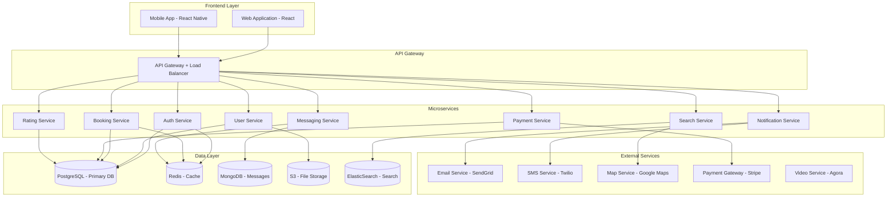
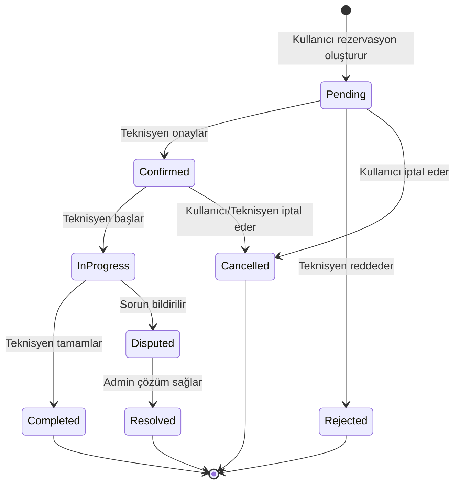
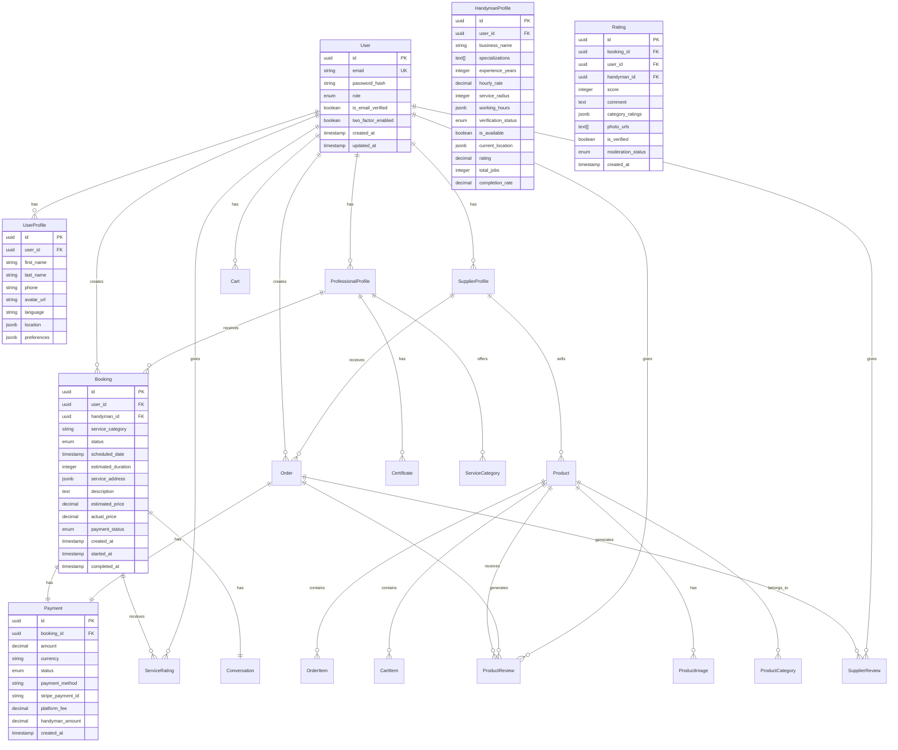

# Tasarım Dokümanı

## Genel Bakış

Bu doküman, Meksika ve Güney Amerika pazarı için geliştirilecek teknisyen bulma platformunun teknik tasarımını tanımlar. Platform, geleneksel pazar yeri modellerinden farklı olarak, güven odaklı, şeffaf ve kullanıcı deneyimi merkezli bir yaklaşım benimser.

### Yenilikçi Özellikler

1. **Gerçek Zamanlı Şeffaflık**: Teknisyenlerin anlık konumu ve müsaitlik durumu
2. **Akıllı Eşleştirme**: Makine öğrenmesi ile kullanıcı-teknisyen uyumluluğu
3. **Dinamik Fiyatlandırma**: Talep, aciliyet ve mesafeye göre otomatik fiyat önerisi
4. **Video Doğrulama**: Teknisyen kimlik ve yetenek doğrulaması için video görüşme
5. **Sosyal Güven Ağı**: Kullanıcıların birbirlerine teknisyen önerme sistemi
6. **Anında Destek**: Hizmet sırasında canlı video desteği ve sorun çözme

## Mimari

### Sistem Mimarisi

Platform, mikroservis mimarisi kullanarak ölçeklenebilir ve bakımı kolay bir yapı sunar.



### Teknoloji Yığını

**Frontend:**
- Web: React 18 + TypeScript + Tailwind CSS
- Mobile: React Native + TypeScript
- State Management: Redux Toolkit + RTK Query
- UI Components: Custom component library (benzersiz tasarım için)

**Backend:**
- Runtime: Node.js 20 + TypeScript
- Framework: NestJS (mikroservis desteği için)
- API: GraphQL (esnek veri sorgulama) + REST (basit işlemler)
- Real-time: Socket.io (canlı bildirimler ve mesajlaşma)

**Database:**
- Primary: PostgreSQL 15 (ilişkisel veriler)
- Cache: Redis 7 (oturum, cache)
- Document: MongoDB 6 (mesajlar, loglar)
- Search: ElasticSearch 8 (teknisyen arama)

**Infrastructure:**
- Cloud: AWS (ölçeklenebilirlik)
- Container: Docker + Kubernetes
- CI/CD: GitHub Actions
- Monitoring: Prometheus + Grafana

## Bileşenler ve Arayüzler

### 1. Authentication Service

Kullanıcı kimlik doğrulama ve yetkilendirme işlemlerini yönetir.

**Sorumluluklar:**
- Kullanıcı kaydı ve giriş
- JWT token yönetimi
- Çok faktörlü kimlik doğrulama (2FA)
- Sosyal medya girişi (Google, Facebook)
- Rol tabanlı erişim kontrolü (RBAC)

**API Endpoints:**
```typescript
interface AuthAPI {
  // Kayıt ve giriş
  register(data: RegisterDTO): Promise<AuthResponse>
  login(credentials: LoginDTO): Promise<AuthResponse>
  logout(token: string): Promise<void>
  
  // Token yönetimi
  refreshToken(refreshToken: string): Promise<TokenResponse>
  verifyToken(token: string): Promise<boolean>
  
  // Şifre yönetimi
  requestPasswordReset(email: string): Promise<void>
  resetPassword(token: string, newPassword: string): Promise<void>
  
  // Email doğrulama
  sendVerificationEmail(userId: string): Promise<void>
  verifyEmail(token: string): Promise<void>
  
  // 2FA
  enable2FA(userId: string): Promise<TwoFactorSecret>
  verify2FA(userId: string, code: string): Promise<boolean>
}
```

**Data Models:**
```typescript
interface User {
  id: string
  email: string
  passwordHash: string
  role: UserRole
  isEmailVerified: boolean
  twoFactorEnabled: boolean
  twoFactorSecret?: string
  createdAt: Date
  updatedAt: Date
}

enum UserRole {
  ADMIN = 'admin',
  PROVIDER = 'provider',
  HANDYMAN = 'handyman',
  USER = 'user'
}

interface AuthResponse {
  accessToken: string
  refreshToken: string
  user: UserProfile
  expiresIn: number
}
```

### 2. User Service

Kullanıcı profilleri ve hesap yönetimini sağlar.

**Sorumluluklar:**
- Profil oluşturma ve güncelleme (teknisyen ve sanatçı)
- Kullanıcı tercihleri yönetimi
- Profil fotoğrafı ve belge yükleme
- Sanatçı portfolyo yönetimi
- Kullanıcı arama ve filtreleme
- Hesap silme ve veri dışa aktarma (GDPR uyumluluğu)

**API Endpoints:**
```typescript
interface UserAPI {
  // Profil yönetimi
  getProfile(userId: string): Promise<UserProfile>
  updateProfile(userId: string, data: UpdateProfileDTO): Promise<UserProfile>
  deleteAccount(userId: string): Promise<void>
  
  // Profesyonel profili (teknisyen veya sanatçı)
  createProfessionalProfile(userId: string, data: ProfessionalProfileDTO): Promise<ProfessionalProfile>
  updateProfessionalProfile(professionalId: string, data: UpdateProfessionalDTO): Promise<ProfessionalProfile>
  getProfessionalProfile(professionalId: string): Promise<ProfessionalProfile>
  
  // Dosya yönetimi
  uploadProfilePhoto(userId: string, file: File): Promise<string>
  uploadCertificate(professionalId: string, file: File): Promise<Certificate>
  
  // Sanatçı portfolyo yönetimi
  uploadPortfolioImage(artistId: string, file: File, metadata: PortfolioMetadata): Promise<PortfolioItem>
  deletePortfolioImage(artistId: string, imageId: string): Promise<void>
  getPortfolio(artistId: string): Promise<PortfolioItem[]>
  updatePortfolioImage(artistId: string, imageId: string, metadata: PortfolioMetadata): Promise<PortfolioItem>
  
  // Tercihler
  updatePreferences(userId: string, preferences: UserPreferences): Promise<void>
  getPreferences(userId: string): Promise<UserPreferences>
}
```

**Data Models:**
```typescript
interface UserProfile {
  id: string
  userId: string
  firstName: string
  lastName: string
  phone: string
  avatar?: string
  language: 'es' | 'en'
  location: Location
  preferences: UserPreferences
  createdAt: Date
  updatedAt: Date
}

enum ProfessionalType {
  HANDYMAN = 'handyman',
  ARTIST = 'artist'
}

interface ProfessionalProfile {
  id: string
  userId: string
  professionalType: ProfessionalType
  businessName?: string
  specializations: string[]
  experienceYears: number
  hourlyRate: number
  serviceRadius: number // km
  workingHours: WorkingHours
  certificates: Certificate[]
  verificationStatus: VerificationStatus
  isAvailable: boolean
  currentLocation?: Coordinates
  rating: number
  totalJobs: number
  completionRate: number
  
  // Sanatçı özel alanları
  portfolio?: PortfolioItem[]
  artStyle?: string[]
  materials?: string[]
  techniques?: string[]
}

interface PortfolioItem {
  id: string
  artistId: string
  imageUrl: string
  thumbnailUrl: string
  title: string
  description?: string
  category: string
  completionDate?: Date
  dimensions?: string
  materials?: string[]
  displayOrder: number
  createdAt: Date
}

interface PortfolioMetadata {
  title: string
  description?: string
  category: string
  completionDate?: Date
  dimensions?: string
  materials?: string[]
}

interface Location {
  address: string
  city: string
  state: string
  country: string
  postalCode: string
  coordinates: Coordinates
}

interface Coordinates {
  latitude: number
  longitude: number
}

interface WorkingHours {
  monday: TimeSlot[]
  tuesday: TimeSlot[]
  wednesday: TimeSlot[]
  thursday: TimeSlot[]
  friday: TimeSlot[]
  saturday: TimeSlot[]
  sunday: TimeSlot[]
}

interface TimeSlot {
  start: string // HH:mm format
  end: string
}

interface Certificate {
  id: string
  name: string
  issuer: string
  issueDate: Date
  expiryDate?: Date
  fileUrl: string
  verifiedByAdmin: boolean
}

enum VerificationStatus {
  PENDING = 'pending',
  VERIFIED = 'verified',
  REJECTED = 'rejected'
}

interface UserPreferences {
  language: 'es' | 'en'
  emailNotifications: boolean
  smsNotifications: boolean
  pushNotifications: boolean
  currency: 'MXN' | 'USD'
}
```

### 3. Search Service

Akıllı profesyonel arama ve eşleştirme sistemi.

**Sorumluluklar:**
- Coğrafi konum bazlı arama
- Kategori ve filtre bazlı arama
- Profesyonel tipine göre filtreleme (teknisyen/sanatçı)
- Makine öğrenmesi ile akıllı eşleştirme
- Arama sonuçlarını sıralama ve önceliklendirme
- Gerçek zamanlı müsaitlik kontrolü
- Sanatçı portfolyo önizleme

**Akıllı Eşleştirme Algoritması:**
```
Eşleştirme Skoru = (
  Mesafe Skoru * 0.25 +
  Değerlendirme Skoru * 0.20 +
  Deneyim Skoru * 0.15 +
  Müsaitlik Skoru * 0.15 +
  Fiyat Uyumluluğu * 0.10 +
  Geçmiş Başarı Oranı * 0.10 +
  Kullanıcı Tercihi Uyumu * 0.05
)

Sanatçılar için ek skorlama:
+ Portfolyo Kalitesi * 0.10
+ Stil Uyumluluğu * 0.05

Mesafe Skoru = max(0, 1 - (mesafe / maksimum_yarıçap))
Değerlendirme Skoru = ortalama_puan / 5
Deneyim Skoru = min(1, deneyim_yılı / 10)
Müsaitlik Skoru = müsait_ise ? 1 : 0.3
Portfolyo Kalitesi = (portfolyo_görsel_sayısı / 20) * ortalama_puan
```

**API Endpoints:**
```typescript
interface SearchAPI {
  // Profesyonel arama
  searchProfessionals(query: SearchQuery): Promise<SearchResults>
  getNearbyProfessionals(location: Coordinates, radius: number, type?: ProfessionalType): Promise<Professional[]>
  getProfessionalsByCategory(category: string, filters: SearchFilters): Promise<Professional[]>
  
  // Akıllı eşleştirme
  getRecommendedProfessionals(userId: string, serviceRequest: ServiceRequestDTO): Promise<Professional[]>
  
  // Müsaitlik kontrolü
  checkAvailability(professionalId: string, date: Date, duration: number): Promise<AvailabilitySlot[]>
  
  // Sanatçı özel arama
  searchArtistsByStyle(style: string, location: Coordinates): Promise<Artist[]>
  getArtistPortfolio(artistId: string): Promise<PortfolioItem[]>
}

interface SearchQuery {
  location: Coordinates
  category?: string
  professionalType?: ProfessionalType
  radius?: number
  minRating?: number
  maxPrice?: number
  availability?: DateRange
  artStyle?: string[]
  sortBy?: 'distance' | 'rating' | 'price' | 'experience' | 'portfolio'
}

interface SearchFilters {
  experienceYears?: number
  verifiedOnly?: boolean
  languages?: string[]
  priceRange?: PriceRange
  hasPortfolio?: boolean
  materials?: string[]
}

interface SearchResults {
  professionals: ProfessionalSearchResult[]
  total: number
  page: number
  pageSize: number
}

interface ProfessionalSearchResult {
  professional: ProfessionalProfile
  distance: number
  matchScore: number
  estimatedPrice: number
  nextAvailableSlot?: Date
  portfolioPreview?: PortfolioItem[]
}
```

### 4. Booking Service

Rezervasyon oluşturma, yönetme ve takip sistemi.

**Sorumluluklar:**
- Rezervasyon oluşturma ve onaylama
- Rezervasyon durumu yönetimi
- Çakışma kontrolü
- Otomatik hatırlatmalar
- Rezervasyon geçmişi

**Rezervasyon Durum Makinesi:**


**API Endpoints:**
```typescript
interface BookingAPI {
  // Rezervasyon yönetimi
  createBooking(data: CreateBookingDTO): Promise<Booking>
  getBooking(bookingId: string): Promise<Booking>
  updateBookingStatus(bookingId: string, status: BookingStatus): Promise<Booking>
  cancelBooking(bookingId: string, reason: string): Promise<void>
  
  // Kullanıcı rezervasyonları
  getUserBookings(userId: string, filters: BookingFilters): Promise<Booking[]>
  getHandymanBookings(handymanId: string, filters: BookingFilters): Promise<Booking[]>
  
  // Durum güncellemeleri
  startService(bookingId: string): Promise<Booking>
  completeService(bookingId: string, notes: string): Promise<Booking>
  reportIssue(bookingId: string, issue: IssueReport): Promise<Dispute>
}
```

**Data Models:**
```typescript
interface Booking {
  id: string
  userId: string
  professionalId: string
  professionalType: ProfessionalType
  serviceCategory: string
  status: BookingStatus
  scheduledDate: Date
  estimatedDuration: number // minutes
  serviceAddress: Location
  description: string
  estimatedPrice: number
  actualPrice?: number
  paymentStatus: PaymentStatus
  createdAt: Date
  updatedAt: Date
  startedAt?: Date
  completedAt?: Date
  cancelledAt?: Date
  cancellationReason?: string
  
  // Sanatsal proje özel alanları
  projectDetails?: ProjectDetails
  progressPhotos?: ProgressPhoto[]
  referenceImages?: string[]
}

interface ProjectDetails {
  projectType: string
  estimatedDuration: string
  priceRange: PriceRange
  specialRequirements?: string
  materials?: string[]
}

interface ProgressPhoto {
  id: string
  url: string
  caption?: string
  uploadedAt: Date
  uploadedBy: string
}

interface PriceRange {
  min: number
  max: number
  currency: string
}

enum BookingStatus {
  PENDING = 'pending',
  CONFIRMED = 'confirmed',
  IN_PROGRESS = 'in_progress',
  COMPLETED = 'completed',
  CANCELLED = 'cancelled',
  REJECTED = 'rejected',
  DISPUTED = 'disputed',
  RESOLVED = 'resolved'
}

enum PaymentStatus {
  PENDING = 'pending',
  AUTHORIZED = 'authorized',
  CAPTURED = 'captured',
  REFUNDED = 'refunded',
  FAILED = 'failed'
}

interface IssueReport {
  bookingId: string
  reportedBy: string
  issueType: IssueType
  description: string
  photos?: string[]
  createdAt: Date
}

enum IssueType {
  NO_SHOW = 'no_show',
  POOR_QUALITY = 'poor_quality',
  DAMAGE = 'damage',
  SAFETY_CONCERN = 'safety_concern',
  PRICING_DISPUTE = 'pricing_dispute',
  OTHER = 'other'
}
```

### 5. Payment Service

Ödeme işlemleri ve finansal yönetim.

**Sorumluluklar:**
- Ödeme işleme (Stripe entegrasyonu)
- Emanet sistemi (escrow)
- Otomatik ödeme dağıtımı
- Fatura ve makbuz oluşturma (faturalı/faturasız)
- Vergi hesaplama ve yönetimi
- Geri ödeme yönetimi
- Komisyon hesaplama

**Ödeme Akışı:**
```
1. Rezervasyon onaylandığında → Kullanıcıdan ödeme yetkisi alınır (authorize)
2. Kullanıcı fatura/faturasız seçimi yapar
3. Faturalı seçilirse → Vergi numarası ve fatura bilgileri alınır
4. Hizmet başladığında → Ödeme emanete alınır (capture)
5. Hizmet tamamlandığında → 24 saat bekleme süresi
6. Sorun yoksa → Teknisyene ödeme yapılır (komisyon düşülerek)
7. Faturalı ise → Resmi fatura oluşturulur ve gönderilir
8. Faturasız ise → Basit ödeme makbuzu oluşturulur
9. Sorun varsa → Dispute süreci başlar
```

**API Endpoints:**
```typescript
interface PaymentAPI {
  // Ödeme işlemleri
  createPaymentIntent(bookingId: string, amount: number, invoiceType: InvoiceType): Promise<PaymentIntent>
  capturePayment(paymentIntentId: string): Promise<Payment>
  refundPayment(paymentId: string, amount: number, reason: string): Promise<Refund>
  
  // Emanet yönetimi
  holdInEscrow(paymentId: string): Promise<void>
  releaseFromEscrow(paymentId: string): Promise<void>
  
  // Ödeme dağıtımı
  distributePayment(bookingId: string): Promise<PaymentDistribution>
  
  // Fatura ve makbuz
  generateInvoice(bookingId: string, invoiceData: InvoiceDataDTO): Promise<Invoice>
  generateReceipt(bookingId: string): Promise<Receipt>
  getInvoice(invoiceId: string): Promise<Invoice>
  getReceipt(receiptId: string): Promise<Receipt>
  
  // Vergi hesaplama
  calculateTax(amount: number, country: string): Promise<TaxCalculation>
  
  // Bakiye ve kazanç
  getHandymanBalance(handymanId: string): Promise<Balance>
  requestPayout(handymanId: string, amount: number): Promise<Payout>
}

enum InvoiceType {
  WITH_INVOICE = 'with_invoice',
  WITHOUT_INVOICE = 'without_invoice'
}

interface PaymentIntent {
  id: string
  amount: number
  currency: string
  clientSecret: string
  status: string
  invoiceType: InvoiceType
  taxAmount?: number
}

interface Payment {
  id: string
  bookingId: string
  amount: number
  currency: string
  status: PaymentStatus
  paymentMethod: string
  invoiceType: InvoiceType
  taxAmount?: number
  createdAt: Date
}

interface Invoice {
  id: string
  bookingId: string
  invoiceNumber: string
  issueDate: Date
  dueDate: Date
  customerInfo: CustomerInvoiceInfo
  items: InvoiceItem[]
  subtotal: number
  taxRate: number
  taxAmount: number
  total: number
  currency: string
  pdfUrl: string
  status: InvoiceStatus
}

interface Receipt {
  id: string
  bookingId: string
  receiptNumber: string
  issueDate: Date
  amount: number
  currency: string
  description: string
  pdfUrl: string
}

interface CustomerInvoiceInfo {
  name: string
  taxId?: string
  address: string
  city: string
  country: string
  postalCode: string
  email: string
}

interface InvoiceItem {
  description: string
  quantity: number
  unitPrice: number
  total: number
}

interface TaxCalculation {
  subtotal: number
  taxRate: number
  taxAmount: number
  total: number
}

enum InvoiceStatus {
  DRAFT = 'draft',
  ISSUED = 'issued',
  PAID = 'paid',
  CANCELLED = 'cancelled'
}

interface PaymentDistribution {
  bookingId: string
  totalAmount: number
  platformFee: number
  handymanAmount: number
  distributedAt: Date
}

interface Balance {
  handymanId: string
  available: number
  pending: number
  currency: string
}
```

### 6. Rating Service

Değerlendirme ve puanlama sistemi.

**Sorumluluklar:**
- Değerlendirme oluşturma
- Ortalama puan hesaplama
- Değerlendirme moderasyonu
- İstatistik hesaplama
- Sahte değerlendirme tespiti

**Değerlendirme Doğrulama:**
```
- Sadece tamamlanmış rezervasyonlar değerlendirilebilir
- Her rezervasyon için bir kez değerlendirme yapılabilir
- Değerlendirme 7 gün içinde yapılmalı (teşvik için)
- Uygunsuz içerik otomatik filtrelenir
- Şüpheli değerlendirmeler admin onayına gider
```

**API Endpoints:**
```typescript
interface RatingAPI {
  // Değerlendirme oluşturma
  createRating(data: CreateRatingDTO): Promise<Rating>
  updateRating(ratingId: string, data: UpdateRatingDTO): Promise<Rating>
  deleteRating(ratingId: string): Promise<void>
  
  // Değerlendirme sorgulama
  getHandymanRatings(handymanId: string, pagination: Pagination): Promise<RatingList>
  getUserRatings(userId: string): Promise<Rating[]>
  getRating(ratingId: string): Promise<Rating>
  
  // İstatistikler
  getHandymanStats(handymanId: string): Promise<RatingStats>
  
  // Moderasyon
  reportRating(ratingId: string, reason: string): Promise<void>
  moderateRating(ratingId: string, action: ModerationAction): Promise<void>
}
```

**Data Models:**
```typescript
interface Rating {
  id: string
  bookingId: string
  userId: string
  handymanId: string
  score: number // 1-5
  comment: string
  categories: CategoryRating[]
  photos?: string[]
  isVerified: boolean
  moderationStatus: ModerationStatus
  createdAt: Date
  updatedAt: Date
}

interface CategoryRating {
  category: RatingCategory
  score: number
}

enum RatingCategory {
  QUALITY = 'quality',
  PUNCTUALITY = 'punctuality',
  COMMUNICATION = 'communication',
  PROFESSIONALISM = 'professionalism',
  VALUE = 'value'
}

enum ModerationStatus {
  PENDING = 'pending',
  APPROVED = 'approved',
  REJECTED = 'rejected',
  FLAGGED = 'flagged'
}

interface RatingStats {
  handymanId: string
  averageScore: number
  totalRatings: number
  categoryAverages: Record<RatingCategory, number>
  ratingDistribution: Record<number, number> // 1-5 stars count
  recentTrend: 'improving' | 'stable' | 'declining'
}
```

### 7. Messaging Service

Gerçek zamanlı mesajlaşma sistemi.

**Sorumluluklar:**
- Kullanıcı-teknisyen mesajlaşması
- Gerçek zamanlı mesaj iletimi
- Mesaj geçmişi saklama
- Dosya paylaşımı
- Okundu bilgisi
- Uygunsuz içerik filtreleme

**API Endpoints:**
```typescript
interface MessagingAPI {
  // Mesaj gönderme
  sendMessage(data: SendMessageDTO): Promise<Message>
  sendFile(conversationId: string, file: File): Promise<Message>
  
  // Mesaj sorgulama
  getConversation(conversationId: string): Promise<Conversation>
  getMessages(conversationId: string, pagination: Pagination): Promise<Message[]>
  getUserConversations(userId: string): Promise<Conversation[]>
  
  // Mesaj durumu
  markAsRead(messageId: string): Promise<void>
  deleteMessage(messageId: string): Promise<void>
  
  // Gerçek zamanlı
  subscribeToConversation(conversationId: string): EventEmitter
  unsubscribeFromConversation(conversationId: string): void
}

interface Conversation {
  id: string
  bookingId: string
  participants: string[]
  lastMessage?: Message
  unreadCount: Record<string, number>
  isActive: boolean
  createdAt: Date
}

interface Message {
  id: string
  conversationId: string
  senderId: string
  content: string
  type: MessageType
  fileUrl?: string
  isRead: boolean
  createdAt: Date
}

enum MessageType {
  TEXT = 'text',
  IMAGE = 'image',
  FILE = 'file',
  SYSTEM = 'system'
}
```

### 8. Notification Service

Çok kanallı bildirim sistemi.

**Sorumluluklar:**
- Email bildirimleri
- SMS bildirimleri
- Push bildirimleri
- Platform içi bildirimler
- Bildirim tercihleri yönetimi
- Bildirim şablonları

**Bildirim Tipleri:**
```typescript
enum NotificationType {
  // Rezervasyon
  BOOKING_CREATED = 'booking_created',
  BOOKING_CONFIRMED = 'booking_confirmed',
  BOOKING_REJECTED = 'booking_rejected',
  BOOKING_CANCELLED = 'booking_cancelled',
  BOOKING_REMINDER = 'booking_reminder',
  BOOKING_STARTED = 'booking_started',
  BOOKING_COMPLETED = 'booking_completed',
  
  // Mesajlaşma
  NEW_MESSAGE = 'new_message',
  
  // Değerlendirme
  NEW_RATING = 'new_rating',
  
  // Ödeme
  PAYMENT_RECEIVED = 'payment_received',
  PAYOUT_PROCESSED = 'payout_processed',
  
  // Sistem
  ACCOUNT_VERIFIED = 'account_verified',
  PROFILE_APPROVED = 'profile_approved',
  PROFILE_REJECTED = 'profile_rejected'
}
```

**API Endpoints:**
```typescript
interface NotificationAPI {
  // Bildirim gönderme
  sendNotification(data: SendNotificationDTO): Promise<void>
  sendBulkNotifications(data: BulkNotificationDTO): Promise<void>
  
  // Bildirim sorgulama
  getUserNotifications(userId: string, filters: NotificationFilters): Promise<Notification[]>
  getUnreadCount(userId: string): Promise<number>
  
  // Bildirim yönetimi
  markAsRead(notificationId: string): Promise<void>
  markAllAsRead(userId: string): Promise<void>
  deleteNotification(notificationId: string): Promise<void>
  
  // Tercihler
  updatePreferences(userId: string, preferences: NotificationPreferences): Promise<void>
}

interface Notification {
  id: string
  userId: string
  type: NotificationType
  title: string
  message: string
  data?: Record<string, any>
  isRead: boolean
  createdAt: Date
}

interface NotificationPreferences {
  email: {
    enabled: boolean
    types: NotificationType[]
  }
  sms: {
    enabled: boolean
    types: NotificationType[]
  }
  push: {
    enabled: boolean
    types: NotificationType[]
  }
}
```

### 9. Supplier Service

Tedarikçi ve ürün yönetimi sistemi.

**Sorumluluklar:**
- Tedarikçi profil yönetimi
- Ürün katalog yönetimi
- Stok yönetimi
- Ürün görsel yönetimi
- Fiyat güncelleme
- Tedarikçi istatistikleri

**API Endpoints:**
```typescript
interface SupplierAPI {
  // Tedarikçi profil yönetimi
  createSupplierProfile(userId: string, data: SupplierProfileDTO): Promise<SupplierProfile>
  updateSupplierProfile(supplierId: string, data: UpdateSupplierDTO): Promise<SupplierProfile>
  getSupplierProfile(supplierId: string): Promise<SupplierProfile>
  
  // Ürün yönetimi
  createProduct(supplierId: string, data: ProductDTO): Promise<Product>
  updateProduct(productId: string, data: UpdateProductDTO): Promise<Product>
  deleteProduct(productId: string): Promise<void>
  getProduct(productId: string): Promise<Product>
  getSupplierProducts(supplierId: string, filters: ProductFilters): Promise<Product[]>
  
  // Stok yönetimi
  updateStock(productId: string, quantity: number): Promise<Product>
  getStockStatus(productId: string): Promise<StockStatus>
  
  // Ürün görselleri
  uploadProductImage(productId: string, file: File): Promise<ProductImage>
  deleteProductImage(productId: string, imageId: string): Promise<void>
  reorderProductImages(productId: string, imageIds: string[]): Promise<void>
  
  // İstatistikler
  getSupplierStats(supplierId: string): Promise<SupplierStats>
}

interface SupplierProfile {
  id: string
  userId: string
  companyName: string
  taxId: string
  businessAddress: Location
  contactPhone: string
  contactEmail: string
  logo?: string
  description?: string
  verificationStatus: VerificationStatus
  rating: number
  totalOrders: number
  responseRate: number
  createdAt: Date
  updatedAt: Date
}

interface Product {
  id: string
  supplierId: string
  name: string
  description: string
  category: string
  price: number
  currency: string
  stockQuantity: number
  isAvailable: boolean
  images: ProductImage[]
  specifications: ProductSpecification[]
  brand?: string
  model?: string
  rating: number
  totalReviews: number
  createdAt: Date
  updatedAt: Date
}

interface ProductImage {
  id: string
  productId: string
  url: string
  thumbnailUrl: string
  displayOrder: number
  createdAt: Date
}

interface ProductSpecification {
  key: string
  value: string
  unit?: string
}

interface StockStatus {
  productId: string
  quantity: number
  isAvailable: boolean
  lowStockThreshold: number
  isLowStock: boolean
}

interface SupplierStats {
  supplierId: string
  totalProducts: number
  activeProducts: number
  totalOrders: number
  completedOrders: number
  averageRating: number
  totalRevenue: number
  responseRate: number
}
```

### 10. Product Service

Ürün arama, sepet ve sipariş yönetimi.

**Sorumluluklar:**
- Ürün arama ve filtreleme
- Sepet yönetimi
- Sipariş oluşturma ve takibi
- Sipariş durumu yönetimi
- Kargo entegrasyonu

**API Endpoints:**
```typescript
interface ProductAPI {
  // Ürün arama
  searchProducts(query: ProductSearchQuery): Promise<ProductSearchResults>
  getProductsByCategory(category: string, filters: ProductFilters): Promise<Product[]>
  getProductDetails(productId: string): Promise<ProductDetails>
  
  // Sepet yönetimi
  addToCart(userId: string, productId: string, quantity: number): Promise<Cart>
  updateCartItem(userId: string, cartItemId: string, quantity: number): Promise<Cart>
  removeFromCart(userId: string, cartItemId: string): Promise<Cart>
  getCart(userId: string): Promise<Cart>
  clearCart(userId: string): Promise<void>
  
  // Sipariş yönetimi
  createOrder(userId: string, data: CreateOrderDTO): Promise<Order>
  getOrder(orderId: string): Promise<Order>
  getUserOrders(userId: string, filters: OrderFilters): Promise<Order[]>
  getSupplierOrders(supplierId: string, filters: OrderFilters): Promise<Order[]>
  updateOrderStatus(orderId: string, status: OrderStatus, data?: UpdateOrderStatusDTO): Promise<Order>
  cancelOrder(orderId: string, reason: string): Promise<Order>
  
  // Kargo takibi
  addTrackingInfo(orderId: string, trackingNumber: string, carrier: string): Promise<Order>
  getTrackingInfo(orderId: string): Promise<TrackingInfo>
}

interface ProductSearchQuery {
  keyword?: string
  category?: string
  minPrice?: number
  maxPrice?: number
  brand?: string
  supplierId?: string
  inStock?: boolean
  sortBy?: 'price' | 'rating' | 'popularity' | 'newest'
}

interface ProductSearchResults {
  products: Product[]
  total: number
  page: number
  pageSize: number
}

interface Cart {
  id: string
  userId: string
  items: CartItem[]
  subtotal: number
  total: number
  currency: string
  updatedAt: Date
}

interface CartItem {
  id: string
  productId: string
  product: Product
  quantity: number
  price: number
  subtotal: number
}

interface Order {
  id: string
  orderNumber: string
  userId: string
  supplierId: string
  items: OrderItem[]
  subtotal: number
  shippingCost: number
  tax: number
  total: number
  currency: string
  status: OrderStatus
  shippingAddress: Location
  billingAddress: Location
  paymentMethod: string
  paymentStatus: PaymentStatus
  trackingNumber?: string
  carrier?: string
  estimatedDelivery?: Date
  deliveredAt?: Date
  createdAt: Date
  updatedAt: Date
}

interface OrderItem {
  id: string
  productId: string
  productName: string
  productImage: string
  quantity: number
  price: number
  subtotal: number
}

enum OrderStatus {
  PENDING = 'pending',
  CONFIRMED = 'confirmed',
  PREPARING = 'preparing',
  SHIPPED = 'shipped',
  DELIVERED = 'delivered',
  CANCELLED = 'cancelled'
}

interface TrackingInfo {
  orderId: string
  trackingNumber: string
  carrier: string
  status: string
  estimatedDelivery?: Date
  trackingEvents: TrackingEvent[]
}

interface TrackingEvent {
  date: Date
  status: string
  location: string
  description: string
}
```

### 11. Product Rating Service

Ürün ve tedarikçi değerlendirme sistemi.

**Sorumluluklar:**
- Ürün değerlendirme yönetimi
- Tedarikçi değerlendirme yönetimi
- Ortalama puan hesaplama
- Değerlendirme moderasyonu
- Tedarikçi yanıtları

**API Endpoints:**
```typescript
interface ProductRatingAPI {
  // Ürün değerlendirme
  createProductReview(data: CreateProductReviewDTO): Promise<ProductReview>
  getProductReviews(productId: string, pagination: Pagination): Promise<ProductReviewList>
  updateProductReview(reviewId: string, data: UpdateReviewDTO): Promise<ProductReview>
  deleteProductReview(reviewId: string): Promise<void>
  
  // Tedarikçi değerlendirme
  createSupplierReview(data: CreateSupplierReviewDTO): Promise<SupplierReview>
  getSupplierReviews(supplierId: string, pagination: Pagination): Promise<SupplierReviewList>
  
  // Tedarikçi yanıtları
  replyToReview(reviewId: string, reply: string): Promise<ReviewReply>
  
  // İstatistikler
  getProductRatingStats(productId: string): Promise<ProductRatingStats>
  getSupplierRatingStats(supplierId: string): Promise<SupplierRatingStats>
}

interface ProductReview {
  id: string
  orderId: string
  userId: string
  productId: string
  rating: number
  comment: string
  images?: string[]
  isVerifiedPurchase: boolean
  helpfulCount: number
  supplierReply?: ReviewReply
  createdAt: Date
  updatedAt: Date
}

interface SupplierReview {
  id: string
  orderId: string
  userId: string
  supplierId: string
  productQualityRating: number
  deliverySpeedRating: number
  communicationRating: number
  overallRating: number
  comment: string
  createdAt: Date
}

interface ReviewReply {
  id: string
  reviewId: string
  supplierId: string
  reply: string
  createdAt: Date
}

interface ProductRatingStats {
  productId: string
  averageRating: number
  totalReviews: number
  ratingDistribution: Record<number, number>
  verifiedPurchasePercentage: number
}

interface SupplierRatingStats {
  supplierId: string
  averageRating: number
  totalReviews: number
  productQualityAverage: number
  deliverySpeedAverage: number
  communicationAverage: number
}
```

## Veri Modelleri

### İlişkisel Veri Modeli (PostgreSQL)



### Document Store (MongoDB)

Mesajlaşma ve log verileri için kullanılır.

```typescript
// Conversation Collection
{
  _id: ObjectId,
  bookingId: string,
  participants: string[],
  messages: [
    {
      id: string,
      senderId: string,
      content: string,
      type: 'text' | 'image' | 'file',
      fileUrl?: string,
      isRead: boolean,
      createdAt: Date
    }
  ],
  isActive: boolean,
  createdAt: Date,
  updatedAt: Date
}

// Activity Log Collection
{
  _id: ObjectId,
  userId: string,
  action: string,
  resource: string,
  resourceId: string,
  metadata: object,
  ipAddress: string,
  userAgent: string,
  timestamp: Date
}
```

## Doğruluk Özellikleri (Correctness Properties)

Bir özellik (property), sistemin tüm geçerli çalıştırmalarında doğru olması gereken bir karakteristik veya davranıştır. Özellikler, insan tarafından okunabilir spesifikasyonlar ile makine tarafından doğrulanabilir doğruluk garantileri arasında köprü görevi görür.

### Property 1: Kullanıcı Kaydı Round-Trip

*Herhangi bir* geçerli email ve şifre kombinasyonu için, kayıt işlemi yapıldığında sistem bir kullanıcı hesabı oluşturmalı ve bu hesap veritabanından geri okunabilmelidir.

**Doğrular: Gereksinim 1.1**

### Property 2: Email Doğrulama Aktivasyonu

*Herhangi bir* kayıtlı kullanıcı için, geçerli bir doğrulama token'ı ile email doğrulama işlemi yapıldığında, kullanıcının `isEmailVerified` alanı `true` olmalıdır.

**Doğrular: Gereksinim 1.2**

### Property 3: Başarılı Giriş Token Üretimi

*Herhangi bir* doğrulanmış kullanıcı için, geçerli kimlik bilgileri ile giriş yapıldığında, sistem geçerli bir JWT token üretmeli ve bu token kullanıcı bilgilerini içermelidir.

**Doğrular: Gereksinim 1.3**

### Property 4: Başarısız Giriş Loglama

*Herhangi bir* yanlış kimlik bilgisi kombinasyonu için, giriş denemesi yapıldığında, sistem hata döndürmeli ve denemeyi activity log'a kaydetmelidir.

**Doğrular: Gereksinim 1.4**

### Property 5: Şifre Hash Güvenliği

*Herhangi bir* kullanıcı için, veritabanında saklanan şifre alanı asla düz metin olmamalı ve hash algoritması ile şifrelenmiş olmalıdır.

**Doğrular: Gereksinim 1.6**

### Property 6: Dil Tercihi Kalıcılığı

*Herhangi bir* kullanıcı için, dil tercihi ayarlandığında, bu tercih kullanıcı profilinde saklanmalı ve sonraki oturumlarda korunmalıdır.

**Doğrular: Gereksinim 2.3**

### Property 7: Profesyonel Profil Round-Trip

*Herhangi bir* geçerli profesyonel profil verisi için (teknisyen veya sanatçı), profil oluşturulup kaydedildiğinde, tüm alanlar (ad, soyad, tip, uzmanlık, deneyim, iletişim, çalışma bölgesi) geri okunduğunda aynı değerleri içermelidir.

**Doğrular: Gereksinim 3.1, 3.2, 3.5**

### Property 7.1: Sanatçı Portfolyo Yönetimi

*Herhangi bir* sanatçı için, portfolyo görseli yüklendiğinde, görsel optimize edilmeli, farklı boyutlarda saklanmalı ve portfolyodan geri okunabilmelidir.

**Doğrular: Gereksinim 3.7, 3.9**

### Property 7.2: Portfolyo Görsel Sayısı Kısıtı

*Herhangi bir* sanatçı için, portfolyoda minimum 3 ve maksimum 20 görsel bulunmalıdır; bu sınırların dışında yükleme denemeleri reddedilmelidir.

**Doğrular: Gereksinim 3.8**

### Property 8: Geçersiz Kategori Reddi

*Herhangi bir* geçersiz hizmet kategorisi için, teknisyen profili oluşturulurken bu kategori eklenmeye çalışıldığında, sistem hata döndürmeli ve eklemeyi reddetmelidir.

**Doğrular: Gereksinim 3.3**

### Property 9: Profil Güncelleme Tutarlılığı

*Herhangi bir* teknisyen profili için, profil bilgileri güncellendiğinde, güncellenen alanlar veritabanından geri okunduğunda yeni değerleri yansıtmalıdır.

**Doğrular: Gereksinim 3.4**

### Property 10: Sertifika Yükleme Round-Trip

*Herhangi bir* geçerli sertifika dosyası için, dosya yüklendiğinde, sertifika bilgileri profilde saklanmalı ve dosya URL'i üzerinden erişilebilir olmalıdır.

**Doğrular: Gereksinim 3.6**

### Property 11: Kategori Bazlı Arama Doğruluğu

*Herhangi bir* hizmet kategorisi için, o kategori ile arama yapıldığında, dönen tüm profesyoneller seçilen kategoride uzmanlığa sahip olmalıdır.

**Doğrular: Gereksinim 4.2**

### Property 11.1: Profesyonel Tip Filtreleme

*Herhangi bir* profesyonel tip filtresi (teknisyen/sanatçı) için, arama yapıldığında, dönen tüm sonuçlar seçilen tipe uygun olmalıdır.

**Doğrular: Gereksinim 4.8**

### Property 11.2: Sanatçı Portfolyo Önizleme

*Herhangi bir* sanatçı arama sonucu için, arama sonuçlarında portfolyo görselleri önizleme olarak gösterilmelidir.

**Doğrular: Gereksinim 4.7**

### Property 12: Coğrafi Filtreleme Doğruluğu

*Herhangi bir* konum ve yarıçap değeri için, arama yapıldığında, dönen tüm teknisyenler belirtilen yarıçap içinde olmalıdır.

**Doğrular: Gereksinim 4.3, 13.5**

### Property 13: Puan Bazlı Sıralama Doğruluğu

*Herhangi bir* teknisyen listesi için, puana göre sıralama yapıldığında, liste azalan puan sırasında olmalıdır (her teknisyen bir öncekinden düşük veya eşit puana sahip olmalıdır).

**Doğrular: Gereksinim 4.4**

### Property 14: Kategori Minimum Teknisyen Invariant

*Herhangi bir* zamanda, her aktif hizmet kategorisinde en az 3 aktif teknisyen bulunmalıdır.

**Doğrular: Gereksinim 4.6**

### Property 15: Rezervasyon Oluşturma Round-Trip

*Herhangi bir* geçerli rezervasyon verisi için, rezervasyon oluşturulduğunda, tüm alanlar (hizmet türü, tarih, saat, adres, açıklama) veritabanından geri okunduğunda aynı değerleri içermelidir.

**Doğrular: Gereksinim 5.1**

### Property 16: Rezervasyon Bildirimi Garantisi

*Herhangi bir* rezervasyon oluşturulduğunda, ilgili teknisyene en az bir bildirim (email veya platform içi) gönderilmelidir.

**Doğrular: Gereksinim 5.2, 10.1**

### Property 17: Rezervasyon Onay Bildirimi

*Herhangi bir* rezervasyon onaylandığında, kullanıcıya bildirim gönderilmeli ve rezervasyon durumu `Confirmed` olmalıdır.

**Doğrular: Gereksinim 5.3, 10.2**

### Property 18: Zaman Çakışması Engelleme

*Herhangi bir* teknisyen için, aynı zaman diliminde çakışan iki rezervasyon oluşturulmaya çalışıldığında, ikinci rezervasyon reddedilmelidir.

**Doğrular: Gereksinim 5.5**

### Property 19: Geçerli Durum Geçişleri

*Herhangi bir* rezervasyon için, durum değişiklikleri sadece geçerli durum makinesine göre olmalıdır (örn: Pending → Confirmed veya Rejected, Confirmed → InProgress veya Cancelled).

**Doğrular: Gereksinim 6.1**

### Property 20: Durum Değişikliği Bildirimi

*Herhangi bir* rezervasyon durum değişikliği için, ilgili taraflara (kullanıcı ve/veya teknisyen) bildirim gönderilmelidir.

**Doğrular: Gereksinim 6.2, 10.3**

### Property 21: Hizmet Tamamlama Değerlendirme İsteği

*Herhangi bir* rezervasyon `Completed` durumuna geçtiğinde, kullanıcıya değerlendirme yapması için bildirim gönderilmelidir.

**Doğrular: Gereksinim 6.4**

### Property 22: Aktif/Geçmiş Rezervasyon Ayrımı

*Herhangi bir* kullanıcı için, aktif rezervasyon listesi sadece `Pending`, `Confirmed`, `InProgress` durumundaki rezervasyonları, geçmiş rezervasyon listesi ise `Completed`, `Cancelled`, `Rejected` durumundaki rezervasyonları içermelidir.

**Doğrular: Gereksinim 6.5**

### Property 23: İptal Nedeni Kaydı

*Herhangi bir* rezervasyon iptal edildiğinde, iptal nedeni rezervasyon kaydında saklanmalı ve teknisyene bildirim gönderilmelidir.

**Doğrular: Gereksinim 6.6**

### Property 24: Değerlendirme Profil Entegrasyonu

*Herhangi bir* değerlendirme oluşturulduğunda, değerlendirme teknisyen profiline eklenmeli ve ortalama puan yeniden hesaplanmalıdır.

**Doğrular: Gereksinim 7.2**

### Property 25: Ortalama Puan Hesaplama Doğruluğu

*Herhangi bir* teknisyen için, ortalama puan tüm değerlendirmelerin aritmetik ortalaması olmalıdır.

**Doğrular: Gereksinim 7.3**

### Property 26: Sadece Tamamlanan Rezervasyon Değerlendirmesi

*Herhangi bir* değerlendirme denemesi için, sadece `Completed` durumundaki rezervasyonlar değerlendirilebilmelidir; diğer durumlar için değerlendirme reddedilmelidir.

**Doğrular: Gereksinim 7.4**

### Property 27: Tek Değerlendirme Kısıtı

*Herhangi bir* kullanıcı-rezervasyon çifti için, kullanıcı aynı rezervasyon için birden fazla değerlendirme yapamaz; ikinci deneme reddedilmelidir.

**Doğrular: Gereksinim 7.6**

### Property 28: Provider Profesyonel İlişkisi

*Herhangi bir* provider için, provider'a bağlı profesyoneller sorgulandığında, dönen liste sadece o provider'ın eklediği profesyonelleri içermelidir.

**Doğrular: Gereksinim 8.1**

### Property 29: Profesyonel Devre Dışı Bırakma Etkisi

*Herhangi bir* profesyonel devre dışı bırakıldığında, o profesyonel için yeni rezervasyon oluşturma denemeleri reddedilmelidir.

**Doğrular: Gereksinim 8.6**

### Property 30: Admin Hesap Askıya Alma Etkisi

*Herhangi bir* hesap admin tarafından askıya alındığında, o hesap ile giriş yapma denemeleri reddedilmelidir.

**Doğrular: Gereksinim 9.3**

### Property 31: Rezervasyon Mesajlaşma Kanalı

*Herhangi bir* rezervasyon oluşturulduğunda, kullanıcı ve teknisyen arasında bir mesajlaşma kanalı (conversation) oluşturulmalıdır.

**Doğrular: Gereksinim 11.1**

### Property 32: Mesaj Gönderme ve Bildirim

*Herhangi bir* mesaj gönderildiğinde, mesaj conversation'a kaydedilmeli ve alıcıya bildirim gönderilmelidir.

**Doğrular: Gereksinim 11.2**

### Property 33: Mesaj Geçmişi Erişimi

*Herhangi bir* conversation için, her iki katılımcı da tüm mesaj geçmişine erişebilmelidir.

**Doğrular: Gereksinim 11.3**

### Property 34: Aktif Rezervasyon Mesajlaşma Kısıtı

*Herhangi bir* mesajlaşma denemesi için, sadece aktif rezervasyonu olan kullanıcılar mesaj gönderebilmelidir; rezervasyonu olmayan kullanıcılar için mesaj reddedilmelidir.

**Doğrular: Gereksinim 11.4**

### Property 35: Tamamlanan Rezervasyon Salt Okunur Mesajlaşma

*Herhangi bir* `Completed` durumundaki rezervasyon için, mesajlaşma kanalı salt okunur olmalı ve yeni mesaj gönderme denemeleri reddedilmelidir.

**Doğrular: Gereksinim 11.5**

### Property 36: Ödeme Bilgisi Şifreleme

*Herhangi bir* ödeme işlemi için, ödeme bilgileri veritabanında şifreli olarak saklanmalıdır (düz metin olmamalıdır).

**Doğrular: Gereksinim 12.3**

### Property 37: Başarılı Ödeme Fatura/Makbuz Oluşturma

*Herhangi bir* başarılı ödeme için, kullanıcının seçimine göre sistem bir fatura (faturalı ödeme) veya makbuz (faturasız ödeme) kaydı oluşturmalı ve kullanıcıya göndermelidir.

**Doğrular: Gereksinim 12.4, 12.9, 12.10**

### Property 37.1: Faturalı Ödeme Vergi Hesaplama

*Herhangi bir* faturalı ödeme için, sistem KDV/vergi tutarını otomatik olarak hesaplamalı ve faturaya eklemelidir.

**Doğrular: Gereksinim 12.11**

### Property 37.2: Fatura Bilgileri Doğrulama

*Herhangi bir* faturalı ödeme talebi için, kullanıcı vergi numarası ve fatura bilgilerini sağlamalıdır; eksik bilgi durumunda işlem reddedilmelidir.

**Doğrular: Gereksinim 12.8**

### Property 38: Emanet Sistemi Durum Bağımlılığı

*Herhangi bir* rezervasyon için, ödeme `Completed` durumuna geçene kadar emanette tutulmalı, tamamlandıktan sonra teknisyene transfer edilmelidir.

**Doğrular: Gereksinim 12.6**

### Property 39: Adres Geocoding Round-Trip

*Herhangi bir* geçerli adres için, adres koordinatlara dönüştürüldüğünde, koordinatlar geçerli latitude/longitude değerleri içermelidir.

**Doğrular: Gereksinim 13.3**

### Property 40: Mesafe Bazlı Sıralama Doğruluğu

*Herhangi bir* teknisyen listesi için, mesafeye göre sıralama yapıldığında, liste artan mesafe sırasında olmalıdır (her teknisyen bir öncekinden uzak veya eşit mesafede olmalıdır).

**Doğrular: Gereksinim 13.4**

### Property 41: Hassas Veri Şifreleme

*Herhangi bir* hassas veri (şifre, ödeme bilgisi) için, veritabanında saklanan değer şifreli olmalıdır.

**Doğrular: Gereksinim 14.1**

### Property 42: Başarısız Giriş Hesap Kilitleme

*Herhangi bir* kullanıcı için, 5 ardışık başarısız giriş denemesinden sonra, hesap geçici olarak kilitlenmeli ve kullanıcıya email bildirimi gönderilmelidir.

**Doğrular: Gereksinim 14.3**

### Property 43: GDPR Veri Silme

*Herhangi bir* kullanıcı için, veri silme talebi yapıldığında, kullanıcının tüm kişisel verileri sistemden silinmelidir.

**Doğrular: Gereksinim 14.5**

### Property 44: Veri Erişim Loglama

*Herhangi bir* hassas veri erişimi için, erişim activity log'a kaydedilmelidir (kullanıcı, zaman, kaynak, aksiyon).

**Doğrular: Gereksinim 14.6**

### Property 45: Ürün Oluşturma Round-Trip

*Herhangi bir* geçerli ürün verisi için, ürün oluşturulup kaydedildiğinde, tüm alanlar (ad, açıklama, kategori, fiyat, stok) geri okunduğunda aynı değerleri içermelidir.

**Doğrular: Gereksinim 16.3**

### Property 46: Ürün Görsel Sayısı Kısıtı

*Herhangi bir* ürün için, minimum 1 ve maksimum 10 görsel bulunmalıdır; bu sınırların dışında yükleme denemeleri reddedilmelidir.

**Doğrular: Gereksinim 16.4**

### Property 47: Stok Tükenmesi Satın Alma Engelleme

*Herhangi bir* ürün için, stok miktarı 0 olduğunda, ürün "stokta yok" olarak işaretlenmeli ve sepete ekleme denemeleri reddedilmelidir.

**Doğrular: Gereksinim 16.7**

### Property 48: Sepet Toplam Hesaplama Doğruluğu

*Herhangi bir* sepet için, toplam tutar sepetteki tüm ürünlerin (miktar × fiyat) toplamına eşit olmalıdır.

**Doğrular: Gereksinim 17.5**

### Property 49: Sipariş Oluşturma Round-Trip

*Herhangi bir* geçerli sipariş verisi için, sipariş oluşturulduğunda, tüm alanlar (ürünler, adres, toplam tutar) veritabanından geri okunduğunda aynı değerleri içermelidir.

**Doğrular: Gereksinim 17.9**

### Property 50: Sipariş Durumu Geçiş Doğruluğu

*Herhangi bir* sipariş için, durum değişiklikleri sadece geçerli durum makinesine göre olmalıdır (örn: Pending → Confirmed → Preparing → Shipped → Delivered).

**Doğrular: Gereksinim 18.1**

### Property 51: Sipariş İptal Kısıtı

*Herhangi bir* sipariş için, sadece Pending ve Confirmed durumlarında iptal edilebilmelidir; diğer durumlarda iptal denemeleri reddedilmelidir.

**Doğrular: Gereksinim 18.7**

### Property 52: Ürün Değerlendirme Kısıtı

*Herhangi bir* ürün değerlendirmesi için, sadece Delivered durumundaki siparişler değerlendirilebilmelidir; diğer durumlar için değerlendirme reddedilmelidir.

**Doğrular: Gereksinim 19.7**

### Property 53: Tek Ürün Değerlendirme Kısıtı

*Herhangi bir* kullanıcı-sipariş-ürün kombinasyonu için, kullanıcı aynı siparişteki aynı ürün için birden fazla değerlendirme yapamaz; ikinci deneme reddedilmelidir.

**Doğrular: Gereksinim 19.8**

### Property 54: Tedarikçi Ortalama Puan Hesaplama

*Herhangi bir* tedarikçi için, ortalama puan tüm tedarikçi değerlendirmelerinin aritmetik ortalaması olmalıdır.

**Doğrular: Gereksinim 19.6**

## Hata Yönetimi

### Hata Kategorileri

**1. Validation Errors (400)**
- Geçersiz input verileri
- Eksik zorunlu alanlar
- Format hataları

**2. Authentication Errors (401)**
- Geçersiz token
- Süresi dolmuş token
- Eksik kimlik bilgileri

**3. Authorization Errors (403)**
- Yetersiz izinler
- Rol tabanlı erişim reddi

**4. Not Found Errors (404)**
- Kaynak bulunamadı
- Geçersiz ID

**5. Conflict Errors (409)**
- Çakışan rezervasyon
- Duplicate kayıt
- İş kuralı ihlali

**6. Server Errors (500)**
- Beklenmeyen hatalar
- Veritabanı hataları
- Dış servis hataları

### Hata Yanıt Formatı

```typescript
interface ErrorResponse {
  error: {
    code: string
    message: string
    details?: any
    timestamp: Date
    requestId: string
  }
}
```

### Hata İşleme Stratejisi

**Retry Mekanizması:**
- Geçici hatalar için otomatik retry (exponential backoff)
- Maksimum 3 deneme
- İdempotent işlemler için güvenli

**Circuit Breaker:**
- Dış servislere yapılan çağrılar için
- Başarısızlık eşiği: %50
- Recovery süresi: 30 saniye

**Graceful Degradation:**
- Kritik olmayan özelliklerin devre dışı bırakılması
- Önbellek kullanımı
- Fallback mekanizmaları

## Test Stratejisi

### İkili Test Yaklaşımı

Platform, hem birim testleri hem de property-based testleri kullanarak kapsamlı test kapsamı sağlar.

**Birim Testleri:**
- Spesifik örnekler ve edge case'ler
- Hata durumları
- Entegrasyon noktaları
- Her bileşen için minimum %80 kod kapsamı

**Property-Based Testler:**
- Evrensel özellikler (yukarıda tanımlanan 44 property)
- Rastgele input üretimi ile kapsamlı test
- Her property testi minimum 100 iterasyon
- Tag formatı: **Feature: technician-marketplace-platform, Property {numara}: {özellik metni}**

### Test Kütüphaneleri

**Backend:**
- Jest (birim ve entegrasyon testleri)
- fast-check (property-based testing)
- Supertest (API testleri)
- TestContainers (veritabanı testleri)

**Frontend:**
- Jest + React Testing Library (birim testleri)
- Cypress (E2E testleri)
- fast-check (property-based testing)

### Test Organizasyonu

```
tests/
├── unit/
│   ├── services/
│   ├── controllers/
│   └── utils/
├── integration/
│   ├── api/
│   └── database/
├── property/
│   ├── auth.property.test.ts
│   ├── booking.property.test.ts
│   ├── rating.property.test.ts
│   └── ...
└── e2e/
    ├── user-flows/
    └── admin-flows/
```

### Continuous Integration

**CI Pipeline:**
1. Lint ve format kontrolü
2. Birim testleri
3. Property-based testler
4. Entegrasyon testleri
5. E2E testler (staging)
6. Güvenlik taraması
7. Performans testleri

**Test Gereksinimleri:**
- Tüm testler geçmeli
- Kod kapsamı minimum %80
- Property testleri 100 iterasyon
- E2E testler kritik akışları kapsamalı
